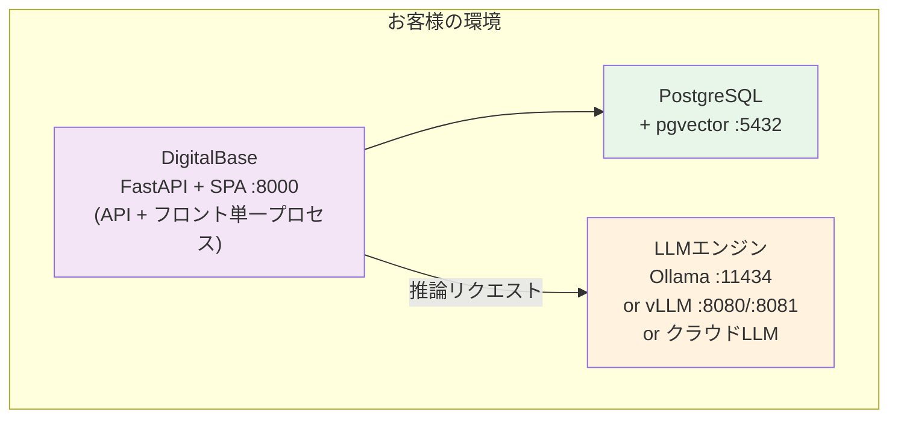

# DigitalBase 製品概要

**Product Overview**

最終更新日: 2026年5月

---

## DigitalBase とは

DigitalBase は、オンプレミス環境で動作する LLM（大規模言語モデル）チャット・RAG・業務自動化プラットフォームです。社内データを外部に出すことなく、安全に AI を活用できます。

> 旧名 LM Light。配布バイナリ・スクリプトでは引き続き `lmlight-vite` の名称が一部残っています。

---

## 特長

### 完全オンプレミス
- すべてのデータがお客様の環境内に留まります
- インターネット接続なしで動作可能
- クラウドへのデータ送信は既定で無し（OpenAI / Anthropic / Gemini 等のクラウド LLM は明示的な設定で任意に有効化）

### ワンコマンドインストール
- macOS / Linux / Windows 対応
- 1つのコマンドでインストール完了（Node.js 不要、API + フロントが単一バイナリ）
- Docker / Docker Compose / Kubernetes (Helm / Kustomize) にも対応

### マルチLLMエンジン
- **Ollama版**: macOS / Linux / Windows（CPU・GPU両対応）
- **vLLM版**: Linux（NVIDIA GPU、高スループット）
- **クラウドLLM**: OpenAI / Anthropic / Gemini を任意に併用可能（`.env` で有効化）
- モデルは自由に選択・切替可能

### エンタープライズ認証
- ローカル認証（ID/パスワード）
- **LDAP / Active Directory 連携**
- **OIDC / Azure AD（Microsoft Entra ID）連携**

### ブランディングカスタマイズ
- カスタムロゴ（テキスト / 画像）
- カスタムタイトル
- カラーテーマ選択（8種類）
- サイドバーメニューの表示/非表示制御

---

## 主要機能

### AIチャット
- 複数のLLMモデルを切り替えて利用
- 会話履歴の保存・管理
- マルチユーザー対応
- ストリーミング応答

### RAG（検索拡張生成）
- 社内ドキュメントをアップロードして AI が回答
- 対応形式: PDF, Word, Excel, PowerPoint, テキスト, Markdown, CSV, JSON, 画像
- pgvector による HNSW / IVFFlat ベクトル検索
- Bot として作成し、タグベースでチーム内共有 + runAs（実行ユーザー権限の委譲）対応
- Web 検索 RAG（任意有効化）

### ドキュメント生成 / Document Creator
- PDF・画像からのテキスト抽出（Vision対応）
- テーブル・Markdown・JSON・SVG・DXF 形式で出力
- Excel / CSV インポート対応
- テンプレートからのドキュメント自動生成

### Pipeline（業務自動化エンジン）
- **80以上のオペレータ**を組み合わせて業務フローを自動化
- 主要オペレータ:
  - **クラウドストレージ**: S3, GCS, Azure Blob, Box, Dropbox, OneDrive, SharePoint, Google Drive
  - **業務システム**: kintone, Salesforce, HubSpot, Notion, Garoon, SmartHR, freee, MoneyForward, Sansan, Backlog, Jira, GitHub, GitLab
  - **データ基盤**: Snowflake, BigQuery, Elasticsearch, PostgreSQL, REST/HTTP, RSS, FTP/SFTP, SMB
  - **コミュニケーション**: Slack, Teams, Discord, LINE Messaging, LINE WORKS, Chatwork, Zoom, Telegram, Gmail, Email送信
  - **広告・分析**: Google Ads, Yahoo Ads, Google Analytics, Shopify, Stripe
  - **AI処理**: LLM, AI分類, RAGロード, 文書比較
  - **データ操作**: Filter, Sort, Aggregate, Merge, Split, Dedup, Validate, Cast, Rename Keys
- スケジューラ実行 / Webhook起動 / 手動実行
- 実行履歴・ログの管理

### MCP サーバー / 外部AIエージェント連携
- Model Context Protocol (MCP) サーバーを内蔵
- Claude Desktop / Cursor / その他 MCP 対応クライアントから DigitalBase の RAG・Pipeline・SQL を直接利用可能
- JSON-RPC エンドポイントで提供

### Helpdesk（社内問い合わせ管理）
- 社内ヘルプデスク機能を内蔵
- 問い合わせの起票・割当・ステータス管理
- RAG / Bot との連携で一次回答を自動化

### SQLエージェント
- 外部データベースに AI で自然言語クエリ
- テーブル一覧・スキーマの自動取得
- データ編集・変更追跡
- 接続情報の保存・共有

### 承認フロー
- 多段階承認プロセス
- 通知機能（Webhook 連携）
- ファイル添付対応

### 文字起こし（オプション）
- 音声ファイルをテキストに変換
- Whisperモデル使用（tiny〜large選択可能）
- GPU対応（Metal / CUDA、RTX 50 Blackwell 対応ビルドあり）
- 対応形式: WAV, MP3, M4A, MP4, WebM, OGG, FLAC, AAC

### 画像処理 / Vision（オプション）
- **物体検出**: YOLOv8モデル（80クラス対応、カスタムモデル利用可）
- **DXF処理**: 図面プレビュー・変換・修正
- 対応形式: PNG, JPG, GIF, BMP, WebP

### ベンチマーク
- LLMモデルの性能比較・評価

### プロンプトライブラリ
- プロンプトの保存・管理・共有

### ファインチューニング受託
- CSV学習データテンプレートの提供
- データ送付による専用モデル受託作成
  > ※ ファインチューニングは受託サービスです。製品内に学習機能は搭載されていません。

---

## ユーザー管理

| ロール | 説明 |
|--------|------|
| ADMIN | システム管理者。全機能にアクセス可能。ユーザー管理・ライセンス管理 |
| SUPER | 共有管理者。タグ管理・ユーザーへのタグ付与が可能 |
| USER | 一般ユーザー。基本機能の利用 |

- タグベースのアクセス制御で Bot・Pipeline・SQL接続情報の共有範囲を管理
- 共有Botは runAs で「作成者の権限で実行」もしくは「呼び出し者の権限で実行」を選択可能
- サイドバーメニューのカスタマイズによる機能制限

---

## 認証方式

| 方式 | 説明 |
|------|------|
| ローカル認証 | ID/パスワード（bcrypt ハッシュ） |
| LDAP | Active Directory / OpenLDAP 対応。初回ログイン時にユーザー自動作成 |
| OIDC | Azure AD（Microsoft Entra ID）対応。初回サインイン時にユーザー自動作成 |

- LDAP/OIDC 環境でも管理者（admin@local）はローカル認証でアクセス可能
- ライセンスに基づくユーザー数制限

---

## システム要件

### Ollama版（推奨）

| 項目 | macOS | Linux | Windows |
|------|-------|-------|---------|
| OS | macOS 12+ | Ubuntu 20.04+ | Windows 10+ |
| CPU | Apple Silicon / Intel | x86_64 | x86_64 |
| メモリ | 8GB以上（16GB推奨） | 8GB以上（16GB推奨） | 8GB以上（16GB推奨） |
| ストレージ | 10GB以上 | 10GB以上 | 10GB以上 |
| GPU | Apple Silicon（Metal） | NVIDIA（CUDA）任意 | NVIDIA（CUDA）任意 |

### vLLM版（高性能）

| 項目 | 要件 |
|------|------|
| OS | Linux（Ubuntu 20.04+） |
| GPU | NVIDIA GPU 必須（CUDA 12.x） |
| VRAM | 8GB以上（モデルサイズに依存） |
| メモリ | 16GB以上 |
| ストレージ | 20GB以上 |
| 推奨機 | NVIDIA DGX Spark, RTX 5060 Ti以上 |

### 必要な依存関係

| 依存関係 | 用途 |
|---------|------|
| PostgreSQL 17 + pgvector | データベース + ベクトル検索 |
| Ollama または vLLM | LLMエンジン |
| FFmpeg | 文字起こし（オプション） |
| Tesseract OCR | OCR処理 |

---

## アーキテクチャ



※ すべてのデータはお客様の環境内に留まります（クラウドLLM明示利用時を除く）

---

## 導入方法

**macOS:**
```bash
curl -fsSL https://pub-a2cab4360f1748cab5ae1c0f12cddc0a.r2.dev/vite-scripts/install-macos.sh | bash
```

**Linux:**
```bash
curl -fsSL https://pub-a2cab4360f1748cab5ae1c0f12cddc0a.r2.dev/vite-scripts/install-linux.sh | bash
```

**Windows:**
```powershell
irm https://pub-a2cab4360f1748cab5ae1c0f12cddc0a.r2.dev/vite-scripts/install-windows.ps1 | iex
```

インストール先: `~/.local/db`（vLLM版は `~/.local/db-vllm`）
起動・停止: `db start` / `db stop`（vLLM版は `db-vllm start` / `db-vllm stop`）

Docker / Kubernetes による導入にも対応:

- **Docker イメージ**: `lmlight/digitalbase-ollama:latest` / `lmlight/digitalbase-vllm:latest` (`linux/amd64` + `linux/arm64`)
- **Helm chart**: `deploy/helm/digitalbase` (3 モード: クラスタ内 GPU / 外部 GPU / マネージド推論 API)
- **Kustomize**: `deploy/k8s/` (overlay で構成切替)

K8s / Docker 配備はサブスクリプションライセンス推奨 (Pod 再スケジュール対応)。

---

## ライセンス

| 種別 | 内容 |
|------|------|
| 買い切り（Perpetual） | 一度の支払いで永続利用。Hardware UUIDに紐付け |
| サブスクリプション（月額/年額） | 契約期間中は最新版を利用可能 |

- 1ライセンス = 1デバイス
- 詳細はお問い合わせください

---

## お問い合わせ

**デジタルベース株式会社**
- メール: info@digital-base.co.jp
- ウェブサイト: https://digital-base.co.jp
- プロダクトサイト: https://lmlight.jp

---

Copyright (c) 2026 デジタルベース株式会社 All rights reserved.
