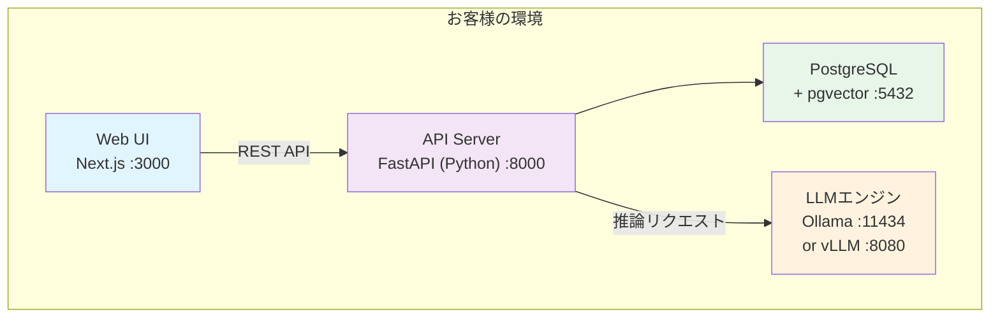

# LM Light 製品概要

**Product Overview**

---

## LM Light とは

LM Light は、オンプレミス環境で動作するLLM（大規模言語モデル）チャット・RAGプラットフォームです。社内データを外部に出すことなく、安全にAIを活用できます。

---

## 特長

### 完全オンプレミス
- すべてのデータがお客様の環境内に留まります
- インターネット接続なしで動作可能
- クラウドへのデータ送信は一切ありません

### ワンコマンドインストール
- macOS / Linux / Windows 対応
- 1つのコマンドでインストール完了
- Docker Compose にも対応

### マルチLLMエンジン
- **Ollama版**: macOS / Linux / Windows（CPU・GPU両対応）
- **vLLM版**: Linux（NVIDIA GPU、高スループット）
- モデルは自由に選択・切替可能

### エンタープライズ認証
- ローカル認証（ID/パスワード）
- **LDAP / Active Directory 連携**
- **OIDC / Azure AD（Microsoft Entra ID）連携**

### ブランディングカスタマイズ
- カスタムロゴ（テキスト / 画像）
- カスタムタイトル
- カラーテーマ選択（8種類）
- サイドバーメニューの表示/非表示制御

---

## 主要機能

### AIチャット
- 複数のLLMモデルを切り替えて利用
- 会話履歴の保存・管理
- マルチユーザー対応

### RAG（検索拡張生成）
- 社内ドキュメントをアップロードしてAIが回答
- 対応形式: PDF, Word, Excel, PowerPoint, テキスト, Markdown, CSV, JSON, 画像
- Bot として作成し、タグベースでチーム内共有

### ドキュメント生成
- PDF・画像からのテキスト抽出（Vision対応）
- テーブル・Markdown・JSON・SVG・DXF 形式で出力
- Excel / CSV インポート対応

### SQLエージェント
- 外部データベースにAIで自然言語クエリ
- テーブル一覧・スキーマの自動取得
- データ編集・変更追跡
- 接続情報の保存・共有

### 業務フロー連携
- Webhookベースの外部ワークフロー連携
- 実行履歴の管理

### 承認フロー
- 多段階承認プロセス
- 通知機能（Webhook連携）
- ファイル添付対応

### 文字起こし（オプション）
- 音声ファイルをテキストに変換
- Whisperモデル使用（tiny〜large選択可能）
- GPU対応（Metal / CUDA）
- 対応形式: WAV, MP3, M4A, MP4, WebM, OGG, FLAC, AAC

### 画像処理 / Vision（オプション）
- **物体検出**: YOLOv8モデル（80クラス対応、カスタムモデル利用可）
- **DXF処理**: 図面プレビュー・変換・修正
- 対応形式: PNG, JPG, GIF, BMP, WebP

### ベンチマーク
- LLMモデルの性能比較・評価

### プロンプトライブラリ
- プロンプトの保存・管理・共有

### ファインチューニングガイド
- CSV学習データテンプレートの提供
- モデル別の要件・手順ガイド

---

## ユーザー管理

| ロール | 説明 |
|--------|------|
| ADMIN | システム管理者。全機能にアクセス可能。ユーザー管理・ライセンス管理 |
| SUPER | 共有管理者。タグ管理・ユーザーへのタグ付与が可能 |
| USER | 一般ユーザー。基本機能の利用 |

- タグベースのアクセス制御でBot・ワークフロー・接続情報の共有範囲を管理
- サイドバーメニューのカスタマイズによる機能制限

---

## 認証方式

| 方式 | 説明 |
|------|------|
| ローカル認証 | ID/パスワード（bcrypt ハッシュ） |
| LDAP | Active Directory / OpenLDAP 対応。初回ログイン時にユーザー自動作成 |
| OIDC | Azure AD（Microsoft Entra ID）対応。初回サインイン時にユーザー自動作成 |

- LDAP/OIDC 環境でも管理者（admin@local）はローカル認証でアクセス可能
- ライセンスに基づくユーザー数制限

---

## システム要件

### Ollama版（推奨）

| 項目 | macOS | Linux | Windows |
|------|-------|-------|---------|
| OS | macOS 12+ | Ubuntu 20.04+ | Windows 10+ |
| CPU | Apple Silicon / Intel | x86_64 | x86_64 |
| メモリ | 8GB以上（16GB推奨） | 8GB以上（16GB推奨） | 8GB以上（16GB推奨） |
| ストレージ | 10GB以上 | 10GB以上 | 10GB以上 |
| GPU | Apple Silicon（Metal） | NVIDIA（CUDA）任意 | NVIDIA（CUDA）任意 |

### vLLM版（高性能）

| 項目 | 要件 |
|------|------|
| OS | Linux（Ubuntu 20.04+） |
| GPU | NVIDIA GPU 必須（CUDA 12.x） |
| VRAM | 8GB以上（モデルサイズに依存） |
| メモリ | 16GB以上 |
| ストレージ | 20GB以上 |

### 必要な依存関係

| 依存関係 | 用途 |
|---------|------|
| Node.js 18+ | フロントエンド |
| PostgreSQL 17 + pgvector | データベース + ベクトル検索 |
| Ollama または vLLM | LLMエンジン |
| FFmpeg | 文字起こし（オプション） |
| Tesseract OCR | OCR処理 |

---

## アーキテクチャ



※ すべてのデータはお客様の環境内に留まります

---

## 導入方法

**macOS:**
```bash
curl -fsSL https://pub-a2cab4360f1748cab5ae1c0f12cddc0a.r2.dev/scripts/install-macos.sh | bash
```

**Linux:**
```bash
curl -fsSL https://pub-a2cab4360f1748cab5ae1c0f12cddc0a.r2.dev/scripts/install-linux.sh | bash
```

**Windows:**
```powershell
irm https://pub-a2cab4360f1748cab5ae1c0f12cddc0a.r2.dev/scripts/install-windows.ps1 | iex
```

Docker Compose による導入にも対応しています。

---

## ライセンス

| 種別 | 内容 |
|------|------|
| 買い切り（Perpetual） | 一度の支払いで永続利用。Hardware UUIDに紐付け |
| サブスクリプション（月額/年額） | 契約期間中は最新版を利用可能 |

- 1ライセンス = 1デバイス
- 詳細はお問い合わせください

---

## お問い合わせ

**デジタルベース株式会社**
- ウェブサイト: https://digital-base.co.jp
- プロダクトサイト: https://lmlight.jp

---

Copyright (c) 2026 デジタルベース株式会社 All rights reserved.
