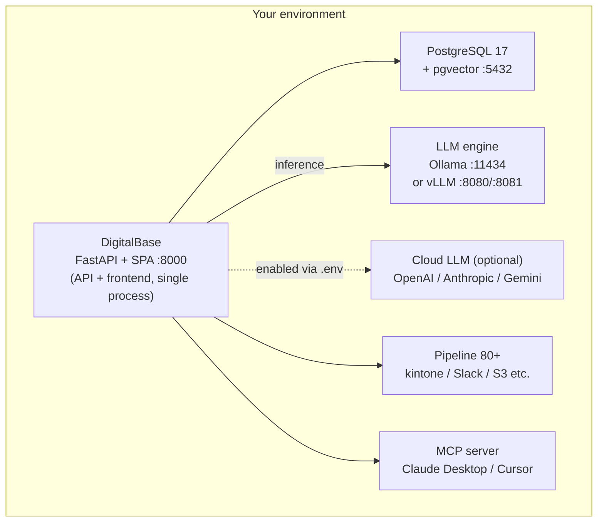

# DigitalBase Product Overview (Confidential)

**Product Overview**

Last updated: May 26, 2026

---

## What is DigitalBase

DigitalBase is an on-premises LLM chat, RAG, and business-automation platform. Use AI safely on internal data without sending anything outside your organization.

---

## Highlights

### Fully on-premises
- All data stays inside your environment
- Operable without an internet connection
- No data is sent to the cloud by default (cloud LLMs such as OpenAI / Anthropic / Gemini can be optionally enabled via explicit configuration)

### One-command install
- Supports macOS / Linux / Windows
- Install completes with a single command (**no Node.js required** — API and frontend run as a single process)
- Docker / Docker Compose are also supported

### Multi-LLM engine
- **Ollama edition**: macOS / Linux / Windows (CPU and GPU both supported)
- **vLLM edition**: Linux (NVIDIA GPU, high throughput)
- **Cloud LLM**: OpenAI / Anthropic / Gemini can be used alongside, optionally (enabled via `.env`)

### Enterprise authentication
- Local authentication (ID/password, bcrypt hashing)
- **LDAP / Active Directory integration** (python-ldap3)
- **OIDC / Azure AD (Microsoft Entra ID) integration**
- LDAP group → tag auto-mapping (shared directory ACL)

### Branding customization
- Custom logo (text / image), custom title, color theme selection (8 themes)
- Show/hide control of sidebar menu items

---

## Key features

### AI Chat
- Multiple LLM model switching, conversation history management, multi-user support
- Streaming responses, Tool Calling, Thinking/Reasoning mode supported

### RAG (Retrieval-Augmented Generation)
- Upload internal documents and let AI answer from them
- Supported formats: PDF, Word (.docx), Excel (.xlsx), Text, Markdown, CSV, JSON, Image (PNG/JPG/GIF/BMP/TIFF)
- **HNSW** vector search via pgvector (cosine similarity)
- Embedding model is switchable (default: embeddinggemma); chunk size / overlap configurable per Bot
- Create as a Bot and share inside the team with tag-based ACL + **runAs** (delegation of executing-user privileges)
- **Web search RAG** (DuckDuckGo / SearXNG, optionally enabled)
- RAG export / import (knowledge can be transported per Bot)

### Document Creator
- Text extraction from PDFs and images (Vision LLM supported)
- Output as table / Markdown / JSON
- Excel / CSV import supported
- **Automatic document generation from templates**
- Folder-level batch processing (PDF / Word / image / CSV / JSON, etc. extracted and formatted sequentially)

### File Hub
- Browse, edit, and connect to LLM tools across all internal files from a single UI
- **Four folder spaces**:
  - **My folder (`myfile/`)**: Personal to each user, invisible to other users
  - **Shared folder (`shared/`)**: Tag-based ACL (assign a tag to a shared directory → members holding that tag can view, edit, and read via LLM tools)
  - **External folder (`external/<label>/`)**: Safely browse existing OS paths exposed by the administrator via `.env` (`EXTERNAL_DATA_DIRS_READ` / `EXTERNAL_DATA_DIRS_WRITE`)
  - **Connection folders (`conn_<id>/`, `oauth_<id>/`)**: Personal OAuth / credential-based connections to remote storage
- **Remote storage connections** (configurable per user, dynamic forms in the UI):
  - **Password / key authentication**: SFTP, SMB / CIFS (AD domain supported), FTP / FTPS (Explicit / Implicit), AWS S3 / S3-compatible, Google Cloud Storage, Azure Storage, WebDAV, HTTP
  - **OAuth**: Google Drive, OneDrive, Dropbox, Box, SharePoint
- **Operations**: Hierarchical directory browse, upload (drag & drop), download, create, rename, delete, move, preview, edit shared ACL
- **LLM chat tool integration**: AI automatically invokes `list_files` / `read_file` / `search_files` / `describe_file` / `write_file` to answer using file contents (binary docx / xlsx / pdf are auto-converted to text)
- **Pipeline integration**: Connection-folder paths (e.g. `conn_<id>/sub/path`) can be referenced directly from operators (a connection created once is reusable across all features)
- **Permission guards**: Files cannot be placed directly under the shared folder (ACL is per directory); ADMIN can view and re-tag every directory; SUPER can retro-tag untagged directories

### Pipeline (business automation engine)
- Combine **no-code operators** to automate business workflows
- Main operators:
  - **Cloud storage**: S3, GCS, Azure Blob, Box, Dropbox, OneDrive, SharePoint, Google Drive, Google Sheets
  - **File transfer**: SFTP, FTP / FTPS, SMB / CIFS, WebDAV / HTTP files, rsync
  - **API integration**: kintone, Salesforce, freee, MoneyForward, Sansan
  - **Data platforms**: Snowflake, BigQuery, Elasticsearch, PostgreSQL, REST/HTTP, RSS
  - **AI processing**: LLM, AI classification, RAG load, document comparison
  - **Data operations**: filter / set / sort / split / aggregate / merge / cast / dedup / validate / rename keys
  - **Flow control**: IF / Switch / Loop
- Scheduled execution / Webhook trigger / manual execution
- Execution history and log management, exponential backoff and retry

### MCP server / external AI agent integration
- **Built-in Model Context Protocol (MCP) server**
- DigitalBase RAG, Pipeline, and SQL can be used directly from Claude Desktop / Cursor / any MCP-compatible client
- Exposed via the `/api/mcp` JSON-RPC endpoint
- ExtAPI → MCP bridge lets external MCP clients invoke business systems

### Helpdesk (internal inquiry management)
- Ticket creation, assignment, status management
- RAG / Bot integration automates first-line responses
- Multi-room (per department/project), unread notifications, Webhook notifications

### SQL agent + Dashboard
- **Natural-language queries with AI** against external databases (PostgreSQL / MySQL / MariaDB / MS SQL / Oracle / SQLite)
- Automatic retrieval of table lists and schemas, data editing, change tracking
- Connection information is saved and shared
- **Dashboard (Canvas-style)** — save SQL results as charts, place freely with drag/resize, 5 chart types (bar / line / pie / pivot / scatter) + value display / reference lines / data labels
- SQL refinement via AI chat (refine dialogue history is preserved)

### Approval flow
- Multi-stage approval process, Webhook notifications, file attachments

### Transcription (optional)
- Convert audio files to text (Whisper, tiny–large selectable)
- GPU support (Metal / CUDA, **including CUDA builds for RTX 50 Blackwell**)
- Supported formats: WAV, MP3, M4A, MP4, WebM, OGG, FLAC, AAC

### Vision / OCR
- **Image understanding via Vision LLM** — Qwen3.6 / Gemma 4 / DeepSeek-OCR / Granite Vision, etc.: a single LLM extracts image contents (object recognition, table extraction, drawing description, handwriting OCR are all handled by a single LLM)
- OCR fallback: Tesseract (Japanese + English)
- Supported formats: PNG, JPG, GIF, BMP, WebP

### Benchmark
- Performance comparison and evaluation of LLM models (speed / quality)

### Prompt library
- Save, manage, and share prompts

---

## User management

| Role | Description |
|------|-------------|
| ADMIN | System administrator. Access to all features. User management, license management |
| SUPER | Sharing administrator. Tag management and assigning tags to users |
| USER | Regular user. Use of basic features |

- Tag-based access control governs the sharing scope of Bots / Pipelines / SQL connections
- Shared Bots / Pipelines can be configured with `shareType` (PRIVATE / TAG / PUBLIC) and `runAs` (caller / owner)
- LDAP group → tag auto-mapping supported
- Feature restriction via sidebar menu customization

---

## Authentication methods

| Method | Description |
|--------|-------------|
| Local authentication | ID/password (passlib bcrypt, 12 rounds) |
| LDAP | Active Directory / OpenLDAP (python-ldap3). Auto-creates a user on first login; retains 30+ LDAP attributes |
| OIDC | Azure AD (Microsoft Entra ID) supported. Auto-creates a user on first sign-in |

- Even in LDAP/OIDC environments, the administrator (admin@local) can sign in via local authentication
- License-based user count limits

---

## System requirements

### Ollama edition (recommended)

| Item | macOS | Linux | Windows |
|------|-------|-------|---------|
| OS | macOS 12+ | Ubuntu 20.04+ | Windows 10+ |
| CPU | Apple Silicon / Intel | x86_64 / ARM64 | x86_64 |
| Memory | 8GB or more (16GB recommended) | 8GB or more (16GB recommended) | 8GB or more (16GB recommended) |
| Storage | 10GB or more | 10GB or more | 10GB or more |
| GPU | Apple Silicon (Metal) | NVIDIA (CUDA) optional | NVIDIA (CUDA) optional |

### vLLM edition (high performance)

| Item | Requirement |
|------|-------------|
| OS | Linux (Ubuntu 20.04+) |
| GPU | NVIDIA GPU required (CUDA 12.x, RTX 50 Blackwell supported) |
| VRAM | 8GB or more (depends on model size) |
| Memory | 16GB or more |
| Storage | 20GB or more |
| Recommended hardware | NVIDIA DGX Spark, RTX 5060 Ti or higher |

### Required dependencies

| Dependency | Purpose |
|------------|---------|
| PostgreSQL 17 + pgvector | Database + vector search |
| Ollama or vLLM | LLM engine |
| FFmpeg | Transcription (optional) |
| Tesseract OCR | OCR processing |

---

## Architecture

DigitalBase serves the **API and frontend (SPA) from a single process on a single port — 8000**. FastAPI returns both REST APIs and the Vite-built static files.



*All data stays inside your environment (except when cloud LLMs are explicitly used)*

---

## Technology stack

| Layer | Technology |
|-------|------------|
| Frontend | Vite + React 19 (static files) + Zustand + localStorage |
| Backend | FastAPI + uvicorn + SQLAlchemy 2.0+ |
| Authentication libraries | python-jose (JWT) / python-ldap3 (LDAP) / passlib bcrypt |
| Database | PostgreSQL 17 + pgvector (DB name / user / password: `digitalbase`) |
| LLM communication | Direct HTTP requests to OpenAI-compatible endpoints via httpx (OpenAI SDK not used) |

---

## Network

| Setting | Default / Note |
|---------|----------------|
| `API_HOST` | **Default `0.0.0.0`** (LAN access allowed). Set to `127.0.0.1` to restrict to the same server |
| `API_PORT` | 8000 (shared by API and Web) |

> In the Vite Edition, the Next.js-era "Web :3000 + API :8000" topology has been retired. The only externally exposed port is **8000**.

---

## Installation

**macOS:**
```bash
curl -fsSL https://pub-a2cab4360f1748cab5ae1c0f12cddc0a.r2.dev/vite-scripts/install-macos.sh | bash
```

**Linux:**
```bash
curl -fsSL https://pub-a2cab4360f1748cab5ae1c0f12cddc0a.r2.dev/vite-scripts/install-linux.sh | bash
```

**Windows:**
```powershell
irm https://pub-a2cab4360f1748cab5ae1c0f12cddc0a.r2.dev/vite-scripts/install-windows.ps1 | iex
```

- Install location: `~/.local/db` (vLLM edition: `~/.local/db-vllm`)
- Start / stop: `db start` / `db stop` (vLLM edition: `db-vllm start` / `db-vllm stop`)
- Deployment via Docker Compose is also supported

---


Copyright (c) 2026 DigitalBase Inc. All rights reserved.
