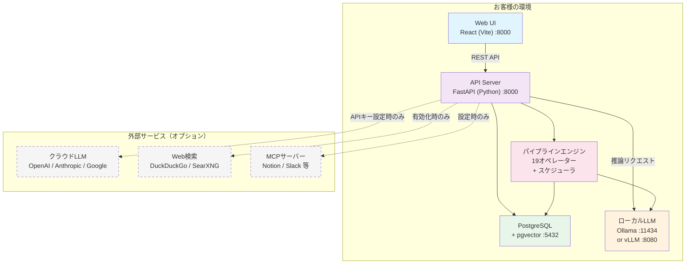

# DigitalBase 製品概要

**Product Overview**

---

## DigitalBase とは

DigitalBase は、セルフホスト型のAIデータ連携基盤です。ローカルAIとデータ連携を1つにまとめ、社内データを外部に出すことなく、AIによる業務自動化を実現します。

---

## 特長

### セルフホスト × AIデータ連携
- すべてのデータがお客様の環境内に留まります
- ローカルAI（Ollama/vLLM）でデータが社外に出ない
- 必要に応じてクラウドLLM（GPT、Claude、Gemini）も利用可能

### ワンコマンドインストール
- macOS / Linux / Windows 対応
- 1つのコマンドでインストール完了（PyInstallerバイナリ配布）
- Docker Compose にも対応

### マルチLLMエンジン
- **Ollama版**: macOS / Linux / Windows（CPU・GPU両対応）
- **vLLM版**: Linux（NVIDIA GPU、高スループット）
- **クラウドLLM**: OpenAI（GPT-5.4系）、Anthropic（Claude 4.6系）、Google（Gemini 2.5系）
- モデルは自由に選択・切替可能（ローカル↔クラウドをヘッダーで切替）

### エンタープライズ認証
- ローカル認証（ID/パスワード）
- **LDAP / Active Directory 連携**
- **OIDC / Azure AD（Microsoft Entra ID）連携**

### ブランディングカスタマイズ
- カスタムロゴ（テキスト / 画像）
- カスタムタイトル
- カラーテーマ選択（8種類）
- サイドバーメニューの表示/非表示制御

---

## 主要機能

### AIエージェント

#### AIチャット
- 複数のLLMモデルを切り替えて利用（ローカル+クラウド）
- 会話履歴の保存・管理
- マルチユーザー対応
- Tool Calling（Web検索、ファイル読み取り、MCP接続）
- Thinking/Reasoning モード対応

#### Web検索RAG
- AIチャット中にWeb検索して最新情報を取得（DuckDuckGo / SearXNG）
- デフォルトOFF（管理者が有効化、ユーザーがON/OFF選択）
- ソースURL付きで回答

#### RAG（検索拡張生成）
- 社内ドキュメントをアップロードしてAIが回答
- 対応形式: PDF, Word, Excel, テキスト, Markdown, CSV, JSON, 画像
- Bot として作成し、タグベースでチーム内共有
- pgvectorによるベクトル検索

#### ドキュメント生成
- PDF・画像からのテキスト抽出（Vision対応）
- テーブル・Markdown・JSON・SVG・DXF 形式で出力
- Excel / CSV インポート対応

#### SQLエージェント
- 外部データベースにAIで自然言語クエリ
- テーブル一覧・スキーマの自動取得
- データ編集・変更追跡
- 接続情報の保存・共有

#### 文字起こし（オプション）
- 音声ファイルをテキストに変換
- Whisperモデル使用（tiny〜large選択可能）
- GPU対応（Metal / CUDA）
- 対応形式: WAV, MP3, M4A, MP4, WebM, OGG, FLAC, AAC

#### 画像処理 / Vision（オプション）
- **物体検出**: YOLOv8モデル（80クラス対応、カスタムモデル利用可）
- **DXF処理**: 図面プレビュー・変換・修正
- **OCR**: Tesseract（日本語+英語）
- 対応形式: PNG, JPG, GIF, BMP, WebP

### データ連携

#### ETLパイプライン（19オペレーター）
- ReactFlowベースのビジュアルキャンバスでドラッグ&ドロップ構築
- ノード間をドラッグ接続、自由配置、位置保存
- cronスケジューラによる定期自動実行
- リトライ（指数バックオフ）+ エラーハンドリング（停止/続行/エラー出力）
- プレビュー（前ステップの出力を自動チェーン）
- 実行履歴 + ファイルダウンロード

| カテゴリ | オペレーター | 内容 |
|---------|------------|------|
| ファイル | ファイル読み込み | CSV, TSV, Excel, JSON, PDF, DOCX, TXT, Markdown, gzip |
| ファイル | ファイル書き出し | CSV, JSON, TSV, gzip（PCダウンロード / サーバー保存） |
| ファイル | RSSフィード | RSS 2.0 / Atom フィード取得 |
| DB | DB読み込み | PostgreSQL（増分同期、パラメータクエリ） |
| DB | DB書き出し | PostgreSQL（追加/置換/マージUpsert、自動テーブル作成） |
| API | REST API | GET/POST/PUT/DELETE、OAuth2、ページネーション |
| API | Webhook送信 | HMAC署名、カスタムヘッダー、ボディテンプレート |
| API | メール送信 | SMTP/TLS、テンプレート（{{count}}、{{data}}） |
| 関数 | AI変換 | LLMでmap（分類・翻訳・抽出）/filter（判定）/reduce（要約） |
| 関数 | コード変換 | サンドボックスPython（安全なビルトイン、モジュール制限） |
| 関数 | フィルター | 12演算子（==, !=, >, contains, regex等）、AND/OR |
| 関数 | フィールド編集 | set/rename/delete/keep_only、{{field}}テンプレート |
| 関数 | ソート | 複数フィールド、重複除去、件数制限、ランダム |
| 関数 | 行分割 | JSON配列展開 / テキスト区切り分割 |
| 関数 | 集計 | group by + 10関数（count, count_unique, sum, avg, min, max, concat, first, last, collect） |
| 関数 | マージ | append / inner join / left join / outer join |
| フロー制御 | IF分岐 | true/false出力、行ごと or バッチ判定、AND/OR条件 |
| フロー制御 | Switch分岐 | フィールド値でN方向ルーティング、デフォルト出力 |
| フロー制御 | ループ | バッチサイズ指定、最大反復回数制限 |

### 業務機能

#### 承認フロー
- 多段階承認プロセス
- 通知機能（Webhook連携）
- ファイル添付対応

#### ヘルプデスク
- マルチルーム対応（部署・プロジェクト別）
- AIボット統合（RAG連携）
- 未読通知
- Webhook通知

#### 共有管理
- タグベースのアクセス制御
- Bot・パイプライン・ワークフロー・接続情報の共有

### ユーティリティ

#### ベンチマーク
- LLMモデルの性能比較・評価（速度・品質）

#### プロンプトライブラリ
- プロンプトの保存・管理・共有

---

## ユーザー管理

| ロール | 説明 |
|--------|------|
| ADMIN | システム管理者。全機能にアクセス可能。ユーザー管理・ライセンス管理 |
| SUPER | 共有管理者。タグ管理・ユーザーへのタグ付与が可能 |
| USER | 一般ユーザー。基本機能の利用 |

- タグベースのアクセス制御でBot・ワークフロー・接続情報の共有範囲を管理
- サイドバーメニューのカスタマイズによる機能制限

---

## 認証方式

| 方式 | 説明 |
|------|------|
| ローカル認証 | ID/パスワード（bcrypt ハッシュ） |
| LDAP | Active Directory / OpenLDAP 対応。初回ログイン時にユーザー自動作成。属性取得（employeeID, department等） |
| OIDC | Azure AD（Microsoft Entra ID）対応。初回サインイン時にユーザー自動作成 |

- LDAP/OIDC 環境でも管理者（admin@local）はローカル認証でアクセス可能
- ライセンスに基づくユーザー数制限

---

## システム要件

### Ollama版（推奨）

| 項目 | macOS | Linux | Windows |
|------|-------|-------|---------|
| OS | macOS 12+ | Ubuntu 20.04+ | Windows 10+ |
| CPU | Apple Silicon / Intel | x86_64 / ARM64 | x86_64 |
| メモリ | 8GB以上（16GB推奨） | 8GB以上（16GB推奨） | 8GB以上（16GB推奨） |
| ストレージ | 10GB以上 | 10GB以上 | 10GB以上 |
| GPU | Apple Silicon（Metal） | NVIDIA（CUDA）任意 | NVIDIA（CUDA）任意 |

### vLLM版（高性能）

| 項目 | 要件 |
|------|------|
| OS | Linux（Ubuntu 20.04+） |
| GPU | NVIDIA GPU 必須（CUDA 12.x） |
| VRAM | 8GB以上（モデルサイズに依存） |
| メモリ | 16GB以上 |
| ストレージ | 20GB以上 |

### 必要な依存関係

| 依存関係 | 用途 |
|---------|------|
| PostgreSQL 17 + pgvector | データベース + ベクトル検索 |
| Ollama または vLLM | ローカルLLMエンジン |
| FFmpeg | 文字起こし（オプション） |
| Tesseract OCR | OCR処理（日本語+英語） |

※ クラウドLLM利用時はインターネット接続が必要です（APIキー設定のみ、ローカルLLMは不要）

---

## アーキテクチャ



※ 実線はオンプレミス内の通信。点線はオプション（管理者が有効化した場合のみ）

---

## 導入方法

**macOS:**
```bash
curl -fsSL https://raw.githubusercontent.com/.../install-macos.sh | bash
db start
```

**Linux:**
```bash
curl -fsSL https://raw.githubusercontent.com/.../install-linux.sh | bash
db start
```

**Linux (vLLM版):**
```bash
curl -fsSL https://raw.githubusercontent.com/.../install-linux-vllm.sh | bash
db-vllm start
```

**Windows:**
```powershell
irm https://raw.githubusercontent.com/.../install-windows.ps1 | iex
db start
```

Docker Compose による導入にも対応しています。

---

## ライセンス

| 種別 | 内容 |
|------|------|
| 買い切り（Perpetual） | 一度の支払いで永続利用。Hardware UUIDに紐付け |
| サブスクリプション（月額/年額） | 契約期間中は最新版を利用可能 |

- 1ライセンス = 1デバイス
- 詳細はお問い合わせください

---

## お問い合わせ

**デジタルベース株式会社**
- ウェブサイト: https://digital-base.co.jp
- プロダクトサイト: https://digitalbase.jp

---

Copyright (c) 2026 デジタルベース株式会社 All rights reserved.
