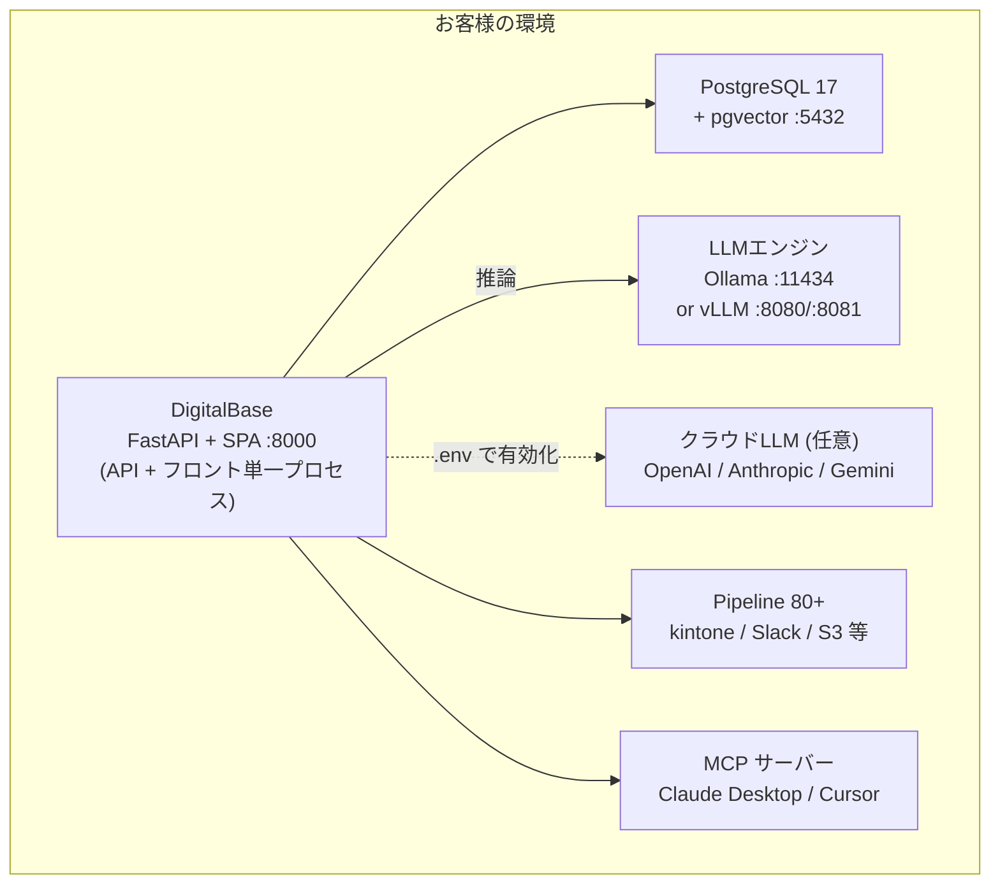

# DigitalBase 製品概要 (Confidential)

**Product Overview**

最終更新日: 2026年5月26日

---

## DigitalBase とは

DigitalBaseは、オンプレミス環境で動作する LLM チャット・RAG・業務自動化プラットフォームです。社内データを外部に出すことなく、安全に AI を活用できます。

---

## 特長

### 完全オンプレミス
- すべてのデータがお客様の環境内に留まります
- インターネット接続なしで動作可能
- クラウドへのデータ送信は既定で無し（OpenAI / Anthropic / Gemini 等のクラウド LLM は明示的な設定で任意に有効化）

### ワンコマンドインストール
- macOS / Linux / Windows 対応
- 1つのコマンドでインストール完了（**Node.js 不要**、API + フロントエンドが単一プロセスで動作）
- Docker / Docker Compose にも対応

### マルチLLMエンジン
- **単一バイナリで 3 つの LLM バックエンドを `.env` の `LLM_BACKEND` で切替**:
  - **Ollama**: macOS / Linux / Windows（CPU・GPU両対応）
  - **vLLM**: Linux（NVIDIA GPU、高スループット）
  - **クラウドLLM**: OpenAI / Anthropic / Gemini を任意に併用可能（`.env` で有効化）

### エンタープライズ認証
- ローカル認証（ID/パスワード、bcrypt ハッシュ）
- **LDAP / Active Directory 連携**（python-ldap3）
- **OIDC / Azure AD（Microsoft Entra ID）連携**
- LDAP グループ → タグ自動マッピング（共有ディレクトリ ACL）

### ブランディングカスタマイズ
- カスタムロゴ（テキスト / 画像）、カスタムタイトル、カラーテーマ選択（8種類）
- サイドバーメニューの表示/非表示制御

---

## 主要機能

### AI チャット
- 複数 LLM モデルの切替・会話履歴管理・マルチユーザー対応
- ストリーミング応答、Tool Calling、Thinking/Reasoning モード対応

### RAG（検索拡張生成）
- 社内ドキュメントをアップロードして AI が回答
- 対応形式: PDF, Word（.docx）, Excel（.xlsx）, テキスト, Markdown, CSV, JSON, 画像（PNG/JPG/GIF/BMP/TIFF）
- pgvector による **HNSW** ベクトル検索（cosine similarity）
- Embedding モデル切替対応（既定: embeddinggemma）、チャンクサイズ / オーバーラップを Bot 単位で設定可能
- Bot として作成し、タグベースでチーム内共有 + **runAs**（実行ユーザー権限の委譲）対応
- **Web 検索 RAG**（DuckDuckGo / SearXNG、任意有効化）
- RAG のエクスポート / インポート（Bot 単位で knowledge を移送可能）

### Document Creator
- PDF・画像からのテキスト抽出（Vision LLM 対応）
- テーブル・Markdown・JSON 形式で出力
- Excel / CSV インポート対応
- **テンプレートからのドキュメント自動生成**
- フォルダ単位の一括処理（PDF / Word / 画像 / CSV / JSON 等を順次抽出 → 整形）

### ファイル管理（File Hub）
- すべての社内ファイルを単一の UI から横断的にブラウズ・編集・LLM 連携
- **4 種類のフォルダ空間**:
  - **マイフォルダ（`myfile/`）**: ユーザー個人専用、他ユーザーからは不可視
  - **共有フォルダ（`shared/`）**: タグベース ACL（共有ディレクトリに tag 割当て → 同 tag を持つメンバーが閲覧・編集・LLM tool 経由 read 可）
  - **外部フォルダ（`external/<label>/`）**: 管理者が `.env` の `EXTERNAL_DATA_DIRS_READ` / `EXTERNAL_DATA_DIRS_WRITE` で公開した OS 上の既存パスを安全に閲覧
  - **接続フォルダ（`conn_<id>/`, `oauth_<id>/`）**: リモートストレージへの個人 OAuth / credential 接続
- **リモートストレージ接続**（個人毎に設定可、UI から動的フォーム）:
  - **パスワード / 鍵認証**: SFTP, SMB / CIFS（AD ドメイン対応）, FTP / FTPS（Explicit / Implicit）, AWS S3 / S3 互換, Google Cloud Storage, Azure Storage, WebDAV, HTTP
  - **OAuth**: Google Drive, OneDrive, Dropbox, Box, SharePoint
- **操作**: ディレクトリ階層ブラウズ、アップロード（ドラッグ&ドロップ）、ダウンロード、新規作成、リネーム、削除、移動、プレビュー、共有 ACL の編集
- **LLM チャットツール連携**: `list_files` / `read_file` / `search_files` / `describe_file` / `write_file` を AI が自動で呼び出し、ファイル内容を参照しながら回答（バイナリ docx / xlsx / pdf も自動でテキスト化）
- **Pipeline 連携**: 接続フォルダのパス（例 `conn_<id>/sub/path`）を operator から直接参照可能（一度作った接続を全機能で再利用）
- **権限ガード**: 共有フォルダ直下にファイル作成不可（ACL は dir 単位）、ADMIN は全 dir 閲覧 / 再 tag 可、SUPER は untagged dir に retro-tag 可

### Pipeline（業務自動化エンジン）
- **ノーコードでオペレータ** を組み合わせて業務フローを自動化
- 主要オペレータ:
  - **ファイル入出力**: File Hub の全接続先（S3 / GCS / Azure Blob / SFTP / FTP・FTPS / SMB・CIFS / WebDAV / HTTP / Google Drive / OneDrive / Dropbox / Box / SharePoint）を「ファイル取得」「ファイル保存」から直接参照（接続は File Hub と共通・一度作れば再利用）、Google Sheets, rsync
  - **API連携**: kintone, Salesforce, freee, MoneyForward, Sansan, HubSpot, SmartHR, Backlog, Notion, Jira, GitHub, GitLab, Shopify, Stripe ほか
  - **データ基盤**: BigQuery, ClickHouse, Snowflake, Elasticsearch, PostgreSQL（DataLake）, REST/HTTP, RSS
  - **AI処理**: LLM 変換, AI 分類, 画像を AI で読み取り（Vision）, RAG ロード / 検索, 文書比較
  - **データ操作**: filter / set / sort / split / limit / aggregate / merge / compare / cast / dedup / validate / rename keys
  - **フロー制御**: IF / Switch / Loop / Wait
- スケジューラ実行 / Webhook 起動 / 手動実行
- 実行履歴・ログの管理、指数バックオフ・リトライ

### MCP サーバー / 外部 AI エージェント連携
- **Model Context Protocol (MCP) サーバーを内蔵**
- Claude Desktop / Cursor / その他 MCP 対応クライアントから DigitalBase の RAG・Pipeline・SQL を直接利用可能
- `/api/mcp` JSON-RPC エンドポイントで提供
- ExtAPI → MCP ブリッジで業務システムを外部 MCP クライアントから呼び出し可能

### Helpdesk（社内問い合わせ管理）
- 問い合わせの起票・割当・ステータス管理
- RAG / Bot との連携で一次回答を自動化
- マルチルーム（部署・プロジェクト別）、未読通知、Webhook 通知

### SQL エージェント + ダッシュボード
- 外部データベース（PostgreSQL / MySQL / MariaDB / MS SQL / Oracle / Amazon Redshift / SQLite）に **AI で自然言語クエリ**
- テーブル一覧・スキーマの自動取得、データ編集・変更追跡
- 接続情報の保存・共有
- **ダッシュボード（Canvas 式）** — 実行した SQL 結果を chart として保存、drag/resize で自由配置、棒/折れ線/円/ピボット/散布の 5 種類のチャート + 値表示・基準線・データラベル
- AI チャットでの SQL リファイン（refine 対話の履歴保持）

### 承認フロー
- 多段階承認プロセス、Webhook 通知、ファイル添付対応

### 文字起こし（オプション）
- 音声ファイルをテキストに変換（Whisper、tiny〜large 選択可能）
- GPU 対応（Metal / CUDA、**RTX 50 Blackwell 対応 CUDA ビルドあり**）
- 対応形式: WAV, MP3, M4A, MP4, WebM, OGG, FLAC, AAC

### Vision / OCR
- **Vision LLM による画像理解** — Qwen3.6 / Gemma 4 / DeepSeek-OCR / Granite Vision など、LLM ベースで画像内容を抽出（物体認識・表抽出・図面記述・手書き OCR を全て LLM 1 つで対応）
- OCR フォールバック: Tesseract（日本語+英語）
- 対応形式: PNG, JPG, GIF, BMP, WebP

### ベンチマーク
- LLM モデルの性能比較・評価（速度・品質）

### プロンプトライブラリ
- プロンプトの保存・管理・共有

---

## ユーザー管理

| ロール | 説明 |
|--------|------|
| ADMIN | システム管理者。全機能にアクセス可能。ユーザー管理・ライセンス管理 |
| SUPER | 共有管理者。タグ管理・ユーザーへのタグ付与が可能 |
| USER | 一般ユーザー。基本機能の利用 |

- タグベースのアクセス制御で Bot・Pipeline・SQL 接続情報の共有範囲を管理
- 共有 Bot / Pipeline には `shareType`（PRIVATE / TAG / PUBLIC）と `runAs`（caller / owner）を設定可能
- LDAP グループ → タグの自動マッピング対応
- サイドバーメニューのカスタマイズによる機能制限

---

## 認証方式

| 方式 | 説明 |
|------|------|
| ローカル認証 | ID/パスワード（passlib bcrypt、12ラウンド） |
| LDAP | Active Directory / OpenLDAP（python-ldap3）。初回ログイン時にユーザー自動作成、LDAP 属性 30+ を保持 |
| OIDC | Azure AD（Microsoft Entra ID）対応。初回サインイン時にユーザー自動作成 |

- LDAP/OIDC 環境でも管理者（admin@local）はローカル認証でアクセス可能
- ライセンスに基づくユーザー数制限

---

## システム要件

### Ollama版（推奨）

| 項目 | macOS | Linux | Windows |
|------|-------|-------|---------|
| OS | macOS 12+ | Ubuntu 20.04+ | Windows 10+ |
| CPU | Apple Silicon / Intel | x86_64 / ARM64 | x86_64 |
| メモリ | 8GB以上（16GB推奨） | 8GB以上（16GB推奨） | 8GB以上（16GB推奨） |
| ストレージ | 10GB以上 | 10GB以上 | 10GB以上 |
| GPU | Apple Silicon（Metal） | NVIDIA（CUDA）任意 | NVIDIA（CUDA）任意 |

### vLLM版（高性能）

| 項目 | 要件 |
|------|------|
| OS | Linux（Ubuntu 20.04+） |
| GPU | NVIDIA GPU 必須（CUDA 12.x、RTX 50 Blackwell 対応） |
| VRAM | 8GB以上（モデルサイズに依存） |
| メモリ | 16GB以上 |
| ストレージ | 20GB以上 |
| 推奨機 | NVIDIA DGX Spark、RTX 5060 Ti 以上 |

### 必要な依存関係

| 依存関係 | 用途 |
|---------|------|
| PostgreSQL 17 + pgvector | データベース + ベクトル検索 |
| Ollama または vLLM | LLM エンジン |
| FFmpeg | 文字起こし（オプション） |
| Tesseract OCR | OCR 処理 |

---

## アーキテクチャ

DigitalBase は **API + フロントエンド（SPA）を単一プロセス・単一ポート 8000** で配信します。FastAPI が REST API と Vite ビルドの静的ファイルの両方を返却。



※ すべてのデータはお客様の環境内に留まります（クラウド LLM 明示利用時を除く）

---

## 技術スタック

| レイヤー | 技術 |
|---------|------|ß
| フロントエンド | Vite + React 19（静的ファイル）+ Zustand + localStorage |
| バックエンド | FastAPI + uvicorn + SQLAlchemy 2.0+ |
| 認証ライブラリ | python-jose（JWT）/ python-ldap3（LDAP）/ passlib bcrypt |
| データベース | PostgreSQL 17 + pgvector（DB 名・ユーザー・パスワード: `digitalbase`） |
| LLM 通信 | httpx による OpenAI 互換エンドポイントへの直接 HTTP リクエスト（OpenAI SDK は不使用） |


---

## ネットワーク

| 設定 | 既定値 / 備考 |
|------|--------------|
| `API_HOST` | **既定 `0.0.0.0`**（LAN 内アクセス可）。同一サーバー内のみに制限する場合は `127.0.0.1` |
| `API_PORT` | 8000（API + Web 共通） |

> Vite Edition では Next.js 時代の「Web :3000 + API :8000」構成は廃止され、外向きに開放するポートは **8000 のみ** です。

---

## 導入方法

**macOS:**
```bash
curl -fsSL https://pub-a2cab4360f1748cab5ae1c0f12cddc0a.r2.dev/vite-scripts/install-macos.sh | bash
```

**Linux:**
```bash
curl -fsSL https://pub-a2cab4360f1748cab5ae1c0f12cddc0a.r2.dev/vite-scripts/install-linux.sh | bash
```

**Windows:**
```powershell
irm https://pub-a2cab4360f1748cab5ae1c0f12cddc0a.r2.dev/vite-scripts/install-windows.ps1 | iex
```

- インストール先: `~/.local/db`（Ollama / vLLM とも共通。単一バイナリで `.env` の `LLM_BACKEND` により切替）
- 起動・停止: `db start` / `db stop`
- Docker Compose による導入にも対応（単一イメージ `digitalbase`、`LLM_BACKEND` で backend 切替）

---


Copyright (c) 2026 デジタルベース株式会社 All rights reserved.
