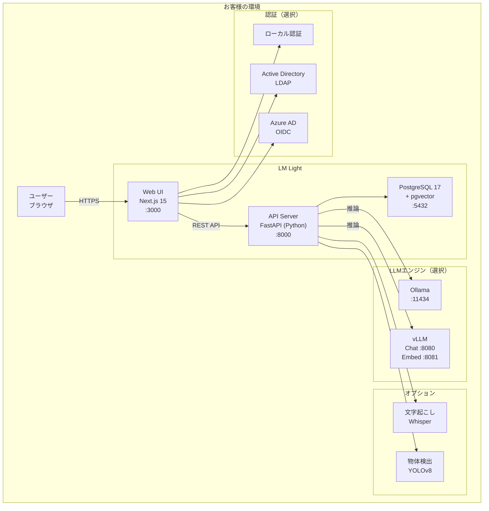
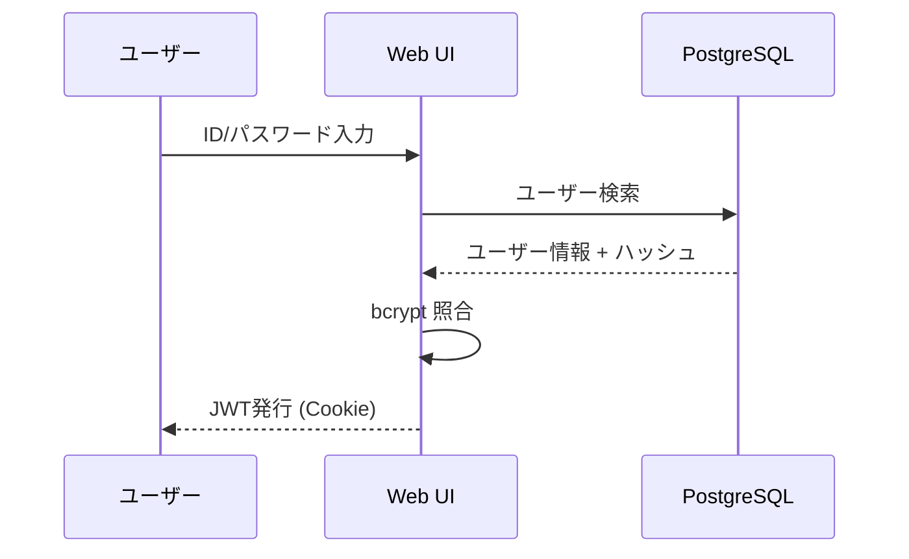
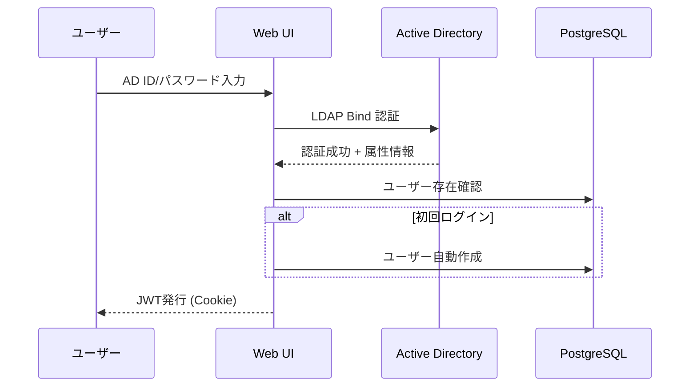
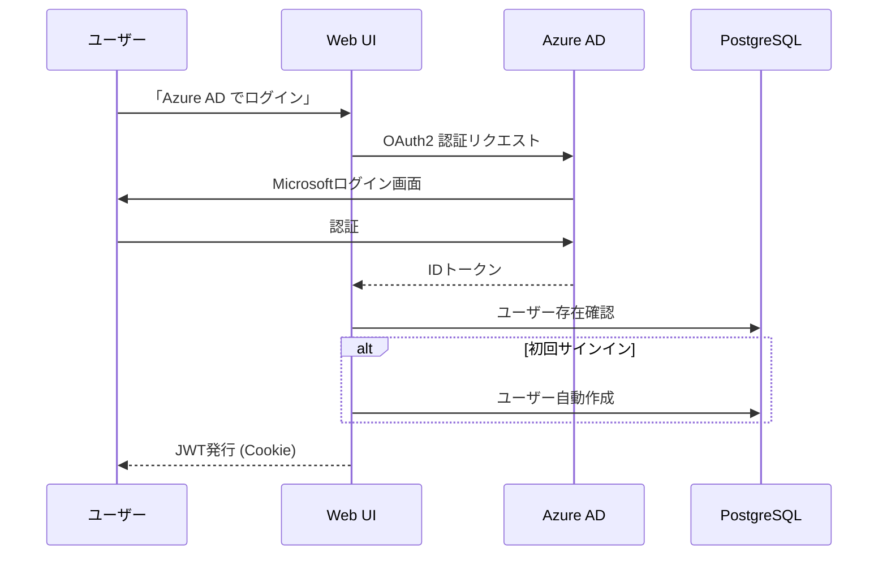
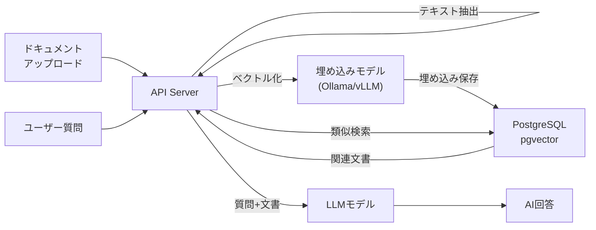

# LM Light システム構成図

**System Architecture**

最終更新日: 2026年3月

---

## システム概要

LM Light は以下のコンポーネントで構成されるオンプレミスAIプラットフォームです。



---

## コンポーネント詳細

### フロントエンド

| 項目 | 内容 |
|------|------|
| フレームワーク | Next.js 15 + React 19 |
| ORM | Prisma 7 + @prisma/adapter-pg |
| 認証 | NextAuth v5 (next-auth 5.0) |
| LDAP | ldapts |
| パスワード | bcryptjs (12ラウンド) |
| ポート | 3000 |

### APIサーバー

| 項目 | 内容 |
|------|------|
| フレームワーク | FastAPI (Python) + uvicorn |
| ORM | SQLAlchemy 2.0+ |
| ベクトル検索 | pgvector |
| 文字起こし | pywhispercpp |
| 物体検出 | ultralytics (YOLOv8) |
| DXF処理 | ezdxf + opencv-python + pymupdf |
| ポート | 8000 |

### データベース

| 項目 | 内容 |
|------|------|
| DBMS | PostgreSQL 17 |
| 拡張 | pgvector（ベクトル類似検索） |
| ポート | 5432 |

### LLMエンジン

| エンジン | ポート | 対応OS | GPU要件 |
|---------|--------|--------|---------|
| Ollama | 11434 | macOS / Linux / Windows | 任意（CPU可） |
| vLLM (Chat) | 8080 | Linux | NVIDIA GPU 必須 |
| vLLM (Embed) | 8081 | Linux | NVIDIA GPU 必須 |

**LLM通信方式:**
- APIサーバーは **httpx（Python HTTPクライアント）** でLLMエンジンと通信
- OpenAI SDK は使用せず、`/v1/chat/completions` 等のOpenAI互換エンドポイントに直接HTTPリクエスト
- Ollama / vLLM いずれもOpenAI互換APIを提供するため、同じコードパスで動作
- `VLLM_AUTO_START=false` に設定することで、外部で起動済みのvLLMサーバーにも接続可能

---

## 認証フロー

### ローカル認証（デフォルト）



### LDAP / Active Directory 認証



### OIDC / Azure AD 認証



---

## データフロー

### RAG（検索拡張生成）



---

## ポート一覧

| サービス | ポート | プロトコル | 備考 |
|---------|--------|-----------|------|
| Web UI | 3000 | HTTP | フロントエンド |
| API Server | 8000 | HTTP | バックエンド |
| PostgreSQL | 5432 | TCP | データベース |
| Ollama | 11434 | HTTP | LLM（Ollama版） |
| vLLM Chat | 8080 | HTTP | LLM（vLLM版） |
| vLLM Embed | 8081 | HTTP | 埋め込み（vLLM版） |

---

## デプロイ構成パターン

### パターン1: シングルサーバー（推奨）

すべてのコンポーネントを1台のサーバーに配置。

```
1台のサーバー
├── Web UI (:3000)
├── API Server (:8000)
├── PostgreSQL (:5432)
└── Ollama / vLLM
```

### パターン2: Docker Compose

Docker Compose で全コンポーネントをコンテナ化。PostgreSQL も含まれるため個別インストール不要。

### パターン3: 分散配置

GPUサーバーにLLMエンジン、別サーバーにWeb/API/DBを配置。`.env` でURLを指定して接続。

---

## お問い合わせ

**デジタルベース株式会社**
- ウェブサイト: https://digital-base.co.jp
- プロダクトサイト: https://lmlight.jp

---

Copyright (c) 2026 デジタルベース株式会社 All rights reserved.
