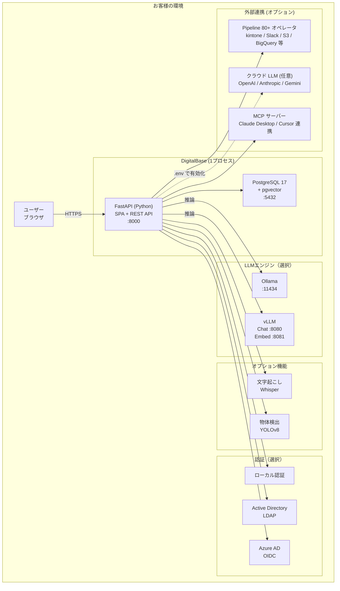
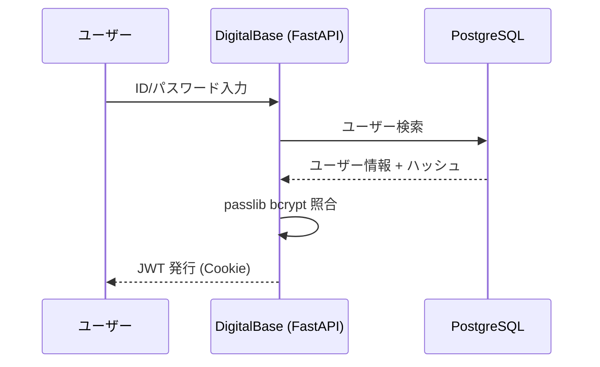
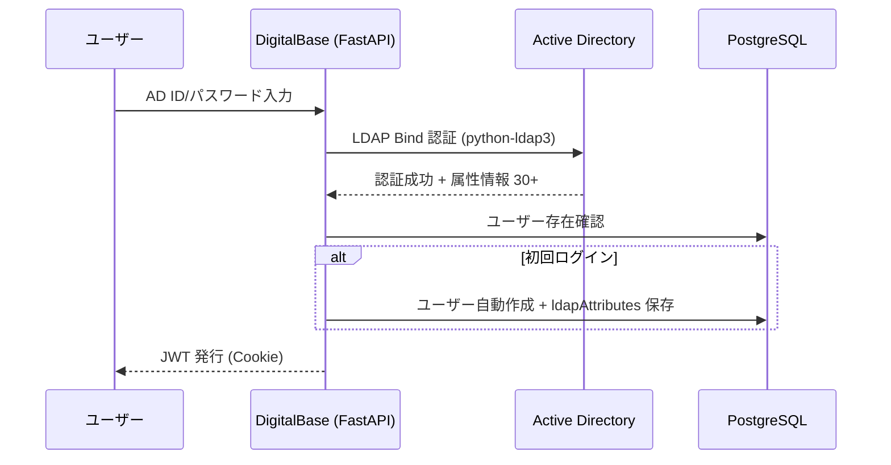
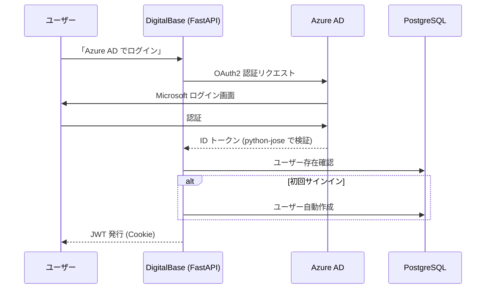
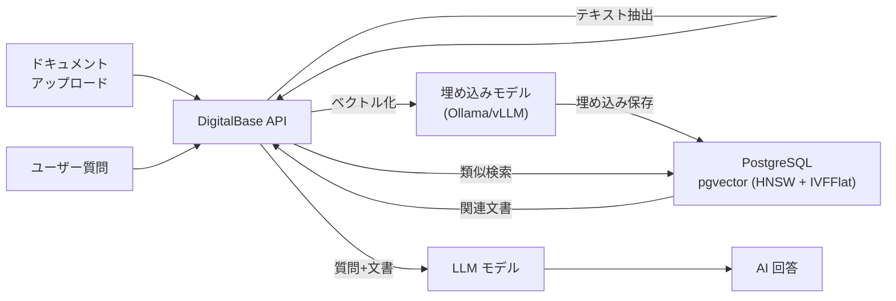

# DigitalBase システム構成図

**System Architecture**

最終更新日: 2026年5月

---

## システム概要

DigitalBase は以下のコンポーネントで構成されるオンプレミス AI プラットフォームです。Vite Edition では **API + フロントエンドを単一プロセス・単一ポート (8000)** で配信します（FastAPI が SPA 静的ファイルも返却）。Node.js は不要です。



※ 実線はオンプレミス内の通信。点線はオプション（管理者が `.env` で有効化した場合のみ）

---

## コンポーネント詳細

### フロントエンド + API サーバー（単一プロセス）

| 項目 | 内容 |
|------|------|
| フレームワーク | FastAPI (Python) + uvicorn |
| 配信形態 | SPA 静的ファイル（Vite + React 19 ビルド成果物）を FastAPI が同居配信 |
| クライアント状態管理 | Zustand + localStorage |
| 認証 | JWT (HS256) + HTTP-only Cookie |
| パスワードハッシュ | passlib bcrypt（12 ラウンド） |
| LDAP | python-ldap3 |
| OIDC | python-jose |
| ORM | SQLAlchemy 2.0+ |
| ベクトル検索 | pgvector（HNSW + IVFFlat） |
| 文字起こし | pywhispercpp / openai-whisper（vLLM 版、RTX 50 Blackwell 対応 CUDA ビルドあり） |
| 物体検出 | ultralytics (YOLOv8) |
| DXF 処理 | ezdxf + opencv-python + pymupdf |
| OCR | Tesseract（jpn+eng） |
| バイナリ配布 | PyInstaller + Cython |
| ポート | 8000（API + Web 共通、`API_PORT` で変更可） |

> Vite Edition 移行に伴い、Next.js 時代の `next-auth` / `bcryptjs` / `ldapts` 等の Node.js 系認証ライブラリは廃止されています。

### データベース

| 項目 | 内容 |
|------|------|
| DBMS | PostgreSQL 17 |
| 拡張 | pgvector（ベクトル類似検索 / HNSW + IVFFlat 対応） |
| デフォルト DB 名 | `digitalbase` |
| デフォルトユーザー | `digitalbase` |
| デフォルトパスワード | `digitalbase` |
| ポート | 5432 |

### LLM エンジン

| エンジン | ポート | 対応 OS | GPU 要件 |
|---------|--------|--------|---------|
| Ollama | 11434 | macOS / Linux / Windows | 任意（CPU 可） |
| vLLM (Chat) | 8080 | Linux | NVIDIA GPU 必須 |
| vLLM (Embed) | 8081 | Linux | NVIDIA GPU 必須 |
| クラウド LLM (任意) | - | OpenAI / Anthropic / Gemini API（`.env` で有効化） | - |

**LLM 通信方式:**
- API サーバーは **httpx（Python HTTP クライアント）** で LLM エンジンと通信
- OpenAI SDK は使用せず、`/v1/chat/completions` 等の OpenAI 互換エンドポイントに直接 HTTP リクエスト
- Ollama / vLLM / クラウド LLM いずれも同じコードパスで動作
- `VLLM_AUTO_START=false` に設定することで、外部で起動済みの vLLM サーバーにも接続可能

### Pipeline エンジン

| 項目 | 内容 |
|------|------|
| オペレータ数 | **80 以上**（source / transform / load / flow / action） |
| 主要コネクタ | kintone, Salesforce, SharePoint, S3, GCS, Azure Blob, Box, Dropbox, OneDrive, Google Drive, Snowflake, BigQuery, Elasticsearch, PostgreSQL, REST/HTTP, RSS, FTP/SFTP, SMB, Slack, Teams, Discord, LINE Messaging, LINE WORKS, Chatwork, Zoom, Telegram, Gmail, send_email, Google Ads, Yahoo Ads, Google Analytics, Shopify, Stripe, HubSpot, Notion, Garoon, SmartHR, freee, MoneyForward, Sansan, Backlog, Jira, GitHub, GitLab |
| AI 処理 | LLM, AI 分類, RAG ロード, 文書比較 |
| データ操作 | filter / set / sort / split / aggregate / merge / cast / dedup / validate |
| フロー制御 | IF / Switch / Loop |
| 実行方式 | 直列実行（stepOrder）+ グラフ走査（edges による BFS） |
| スケジューラ | APScheduler（cron 式） |
| リトライ | 指数バックオフ（3 回、429 検知） |

### MCP サーバー

| 項目 | 内容 |
|------|------|
| エンドポイント | `/api/mcp`（JSON-RPC） |
| クライアント | Claude Desktop / Cursor / その他 MCP 対応クライアント |
| 提供機能 | RAG / Pipeline / SQL を直接呼び出し |
| ExtAPI ブリッジ | 保存済み API Connection を `mcpEnabled` フラグでオプトイン公開 |

---

## 認証フロー

### ローカル認証（デフォルト）



### LDAP / Active Directory 認証



### OIDC / Azure AD 認証



---

## データフロー

### RAG（検索拡張生成）



---

## ポート一覧

| サービス | ポート | プロトコル | 備考 |
|---------|--------|-----------|------|
| DigitalBase (API + Web) | 8000 | HTTP | 単一プロセス・単一ポート |
| PostgreSQL | 5432 | TCP | データベース |
| Ollama | 11434 | HTTP | LLM（Ollama 版） |
| vLLM Chat | 8080 | HTTP | LLM（vLLM 版） |
| vLLM Embed | 8081 | HTTP | 埋め込み（vLLM 版） |

> 旧 Next.js 時代に存在した「Web :3000 / API :8000」の 2 ポート構成は廃止されました。Vite Edition では FastAPI が SPA も配信するため、**外向きに開放するポートは 8000 のみ** です。

---

## デプロイ構成パターン

### パターン 1: シングルサーバー（推奨）

すべてのコンポーネントを 1 台のサーバーに配置。

```
1台のサーバー
├── DigitalBase (:8000, API + Web 一体)
├── PostgreSQL (:5432)
└── Ollama / vLLM
```

### パターン 2: Docker Compose

Docker Compose で全コンポーネントをコンテナ化。PostgreSQL も含まれるため個別インストール不要。

### パターン 3: 分散配置

GPU サーバーに LLM エンジン、別サーバーに DigitalBase + DB を配置。`.env` で `OLLAMA_BASE_URL` / `VLLM_BASE_URL` を指定して接続。

---

## ネットワークバインド

| 設定 | 影響 |
|------|------|
| `API_HOST=0.0.0.0`（既定） | LAN 内の他 PC・スマホからアクセス可能 |
| `API_HOST=127.0.0.1` | サーバー本体からのみアクセス可（最もセキュア） |

> インストーラーは利便性を優先して `0.0.0.0` を既定とします。LAN 露出を避けたい場合は `~/.local/db/.env` の `API_HOST` を `127.0.0.1` に変更してください（vLLM 版は `~/.local/db-vllm/.env`）。

---

## 起動コマンド

| 版 | コマンド |
|----|---------|
| Ollama 版 | `db start` / `db stop` |
| vLLM 版 | `db-vllm start` / `db-vllm stop` |

---

## お問い合わせ

**デジタルベース株式会社**
- メール: info@digital-base.co.jp
- ウェブサイト: https://digital-base.co.jp
- プロダクトサイト: https://digital-base.co.jp/lmlight

---

Copyright (c) 2026 デジタルベース株式会社 All rights reserved.
