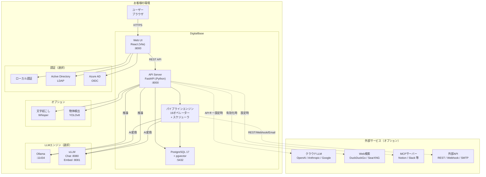
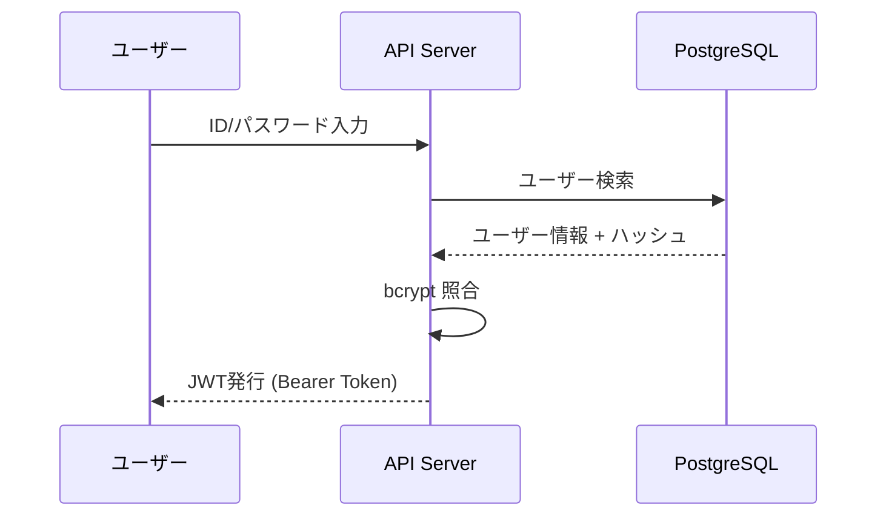
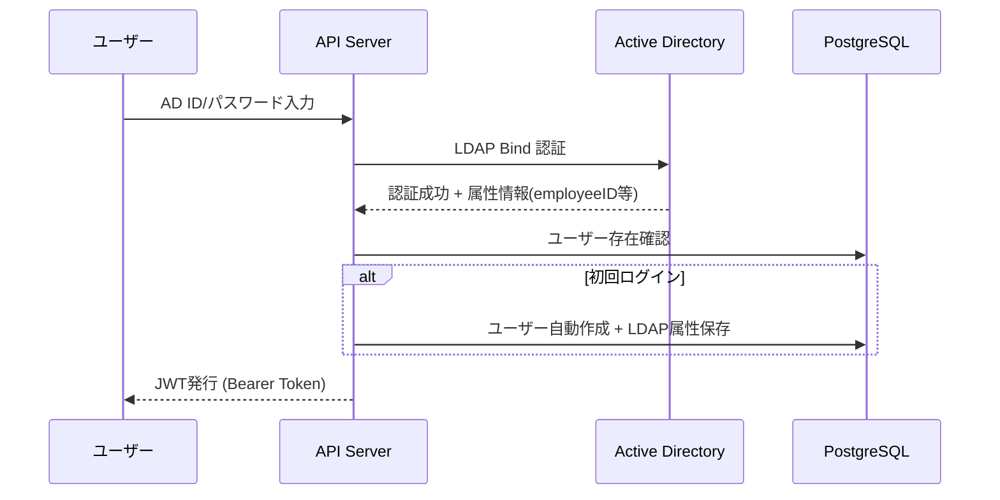
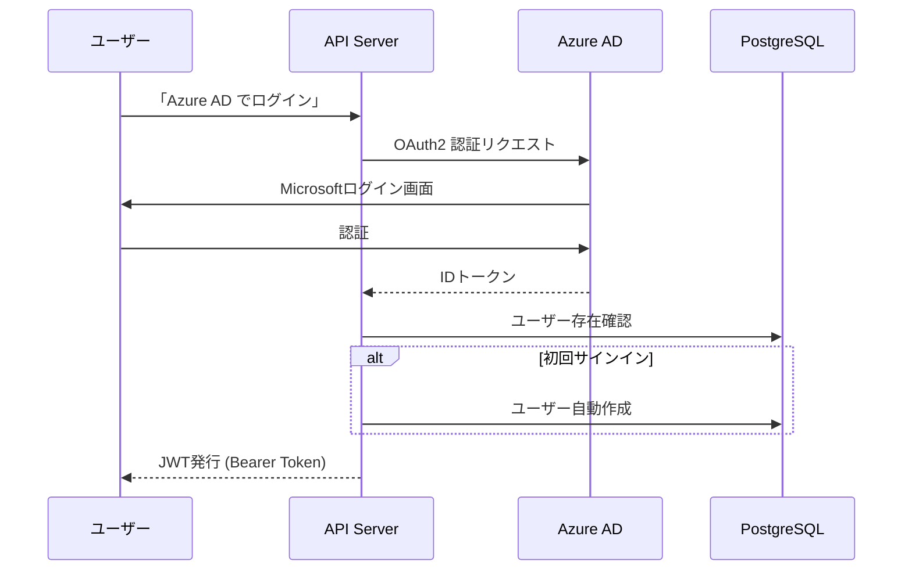
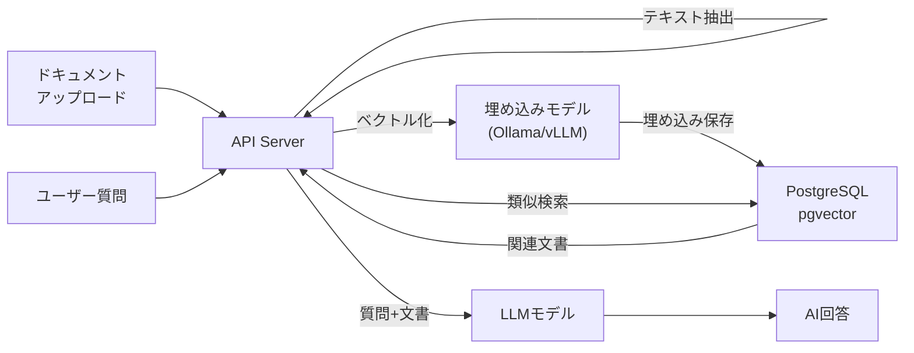
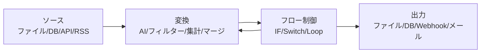
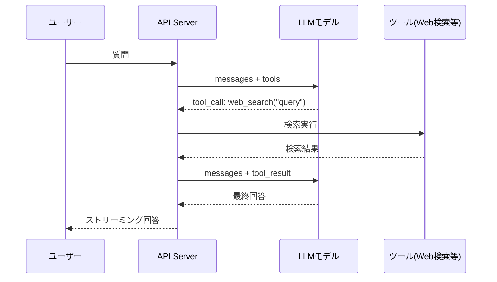

# DigitalBase システム構成図

**System Architecture**

最終更新日: 2026年4月

---

## システム概要

DigitalBase は以下のコンポーネントで構成されるセルフホスト型AIデータ連携基盤です。



※ 実線はオンプレミス内の通信。点線はオプション（管理者が有効化した場合のみ）

---

## コンポーネント詳細

### フロントエンド

| 項目 | 内容 |
|------|------|
| フレームワーク | Vite + React 19 |
| UIライブラリ | shadcn/ui (Tailwind CSS) |
| パイプラインキャンバス | ReactFlow |
| 認証 | JWT (Bearer Token) |
| ポート | 8000（API Serverと統合） |

### APIサーバー

| 項目 | 内容 |
|------|------|
| フレームワーク | FastAPI (Python) + uvicorn |
| ORM | SQLAlchemy 2.0+ |
| ベクトル検索 | pgvector |
| LLM通信 | httpx（OpenAI SDK不使用） |
| パイプラインエンジン | 19オペレーター + APScheduler |
| 文字起こし | pywhispercpp (Ollama版) / openai-whisper (vLLM版) |
| 物体検出 | ultralytics (YOLOv8) |
| DXF処理 | ezdxf + opencv-python + pymupdf |
| OCR | Tesseract (jpn+eng) |
| バイナリ配布 | PyInstaller + Cython |
| ポート | 8000 |

### データベース

| 項目 | 内容 |
|------|------|
| DBMS | PostgreSQL 17 |
| 拡張 | pgvector（ベクトル類似検索） |
| スキーマ | public（アプリデータ）+ pgvector（埋め込みベクトル） |
| ポート | 5432 |

### LLMエンジン

| エンジン | ポート | 対応OS | GPU要件 |
|---------|--------|--------|---------|
| Ollama | 11434 | macOS / Linux / Windows | 任意（CPU可） |
| vLLM (Chat) | 8080 | Linux | NVIDIA GPU 必須 |
| vLLM (Embed) | 8081 | Linux | NVIDIA GPU 必須 |
| クラウドLLM | - | 全OS | 不要（APIキーのみ） |

**LLM通信方式:**
- APIサーバーは **httpx（Python HTTPクライアント）** でLLMエンジンと通信
- OpenAI SDK は使用せず、直接HTTPリクエスト
- Ollama: `/api/chat`、`/api/generate`、`/api/embed`
- vLLM: `/v1/chat/completions`、`/v1/embeddings`（OpenAI互換）
- クラウドLLM: OpenAI `/v1/chat/completions`、Anthropic `/v1/messages`、Gemini `/v1beta/openai/chat/completions`

### パイプラインエンジン

| 項目 | 内容 |
|------|------|
| オペレーター数 | 19種（source / transform / load / flow / action） |
| 実行方式 | 直列実行（stepOrder）+ グラフ走査（edges） |
| フロー制御 | IF分岐、Switch分岐、ループ |
| スケジューラ | APScheduler（cron式） |
| リトライ | 指数バックオフ（retry_wait_ms × 2^attempt） |
| エラーハンドリング | stop / continue / continue_with_error_output |

### Tool Calling

| 項目 | 内容 |
|------|------|
| 組み込みツール | web_search、read_file、list_directory、sql_query |
| MCP接続 | MCPサーバーからツール一覧取得 + 実行（JSON-RPC） |
| 対応プロバイダー | OpenAI、Anthropic、Gemini、Ollama（対応モデルのみ） |
| ユーザー設定 | user-settingsでツールON/OFF + MCPサーバー管理 |

---

## 認証フロー

### ローカル認証（デフォルト）



### LDAP / Active Directory 認証



### OIDC / Azure AD 認証



---

## データフロー

### RAG（検索拡張生成）



### パイプライン実行



### Tool Calling（チャット）



---

## ポート一覧

| サービス | ポート | プロトコル | 備考 |
|---------|--------|-----------|------|
| Web UI + API | 8000 | HTTP | フロント+バックエンド統合 |
| PostgreSQL | 5432 | TCP | データベース |
| Ollama | 11434 | HTTP | LLM（Ollama版） |
| vLLM Chat | 8080 | HTTP | LLM（vLLM版） |
| vLLM Embed | 8081 | HTTP | 埋め込み（vLLM版） |

---

## デプロイ構成パターン

### パターン1: シングルサーバー（推奨）

すべてのコンポーネントを1台のサーバーに配置。

```
1台のサーバー
├── DigitalBase (:8000) — Web UI + API + パイプライン
├── PostgreSQL (:5432)
└── Ollama / vLLM
```

### パターン2: Docker Compose

Docker Compose で全コンポーネントをコンテナ化。PostgreSQL も含まれるため個別インストール不要。

### パターン3: 分散配置

GPUサーバーにLLMエンジン、別サーバーにWeb/API/DBを配置。`.env` でURLを指定して接続。

---

## 起動コマンド

| 版 | コマンド |
|----|---------|
| Ollama版 | `db start` |
| vLLM版 | `db-vllm start` |

---

## お問い合わせ

**デジタルベース株式会社**
- ウェブサイト: https://digital-base.co.jp
- プロダクトサイト: https://digital-base.co.jp/lmlight

---

Copyright (c) 2026 デジタルベース株式会社 All rights reserved.
