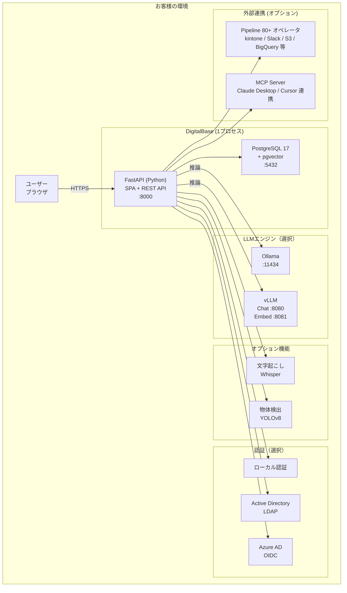
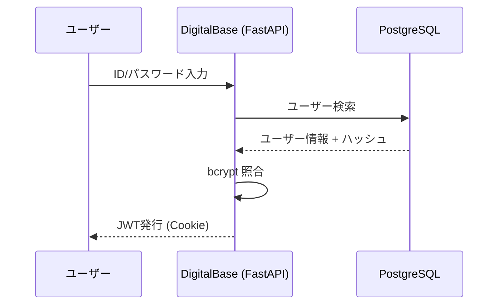
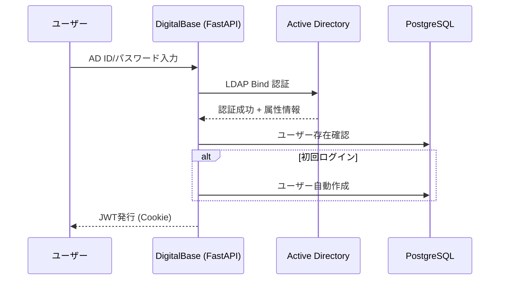
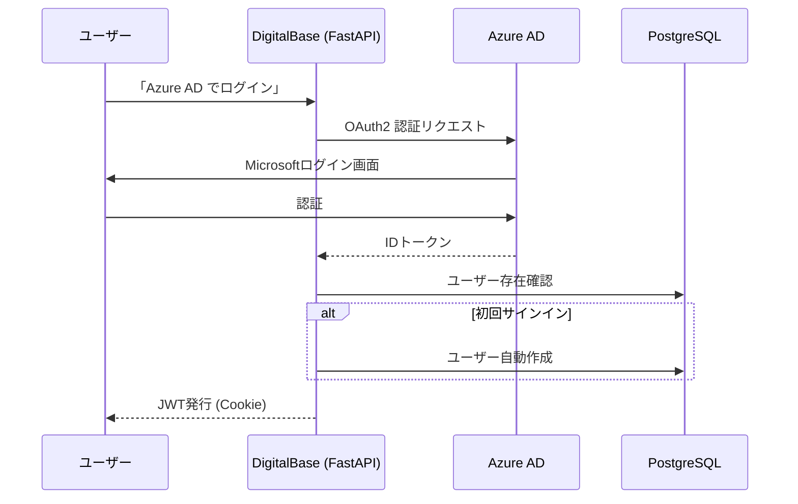
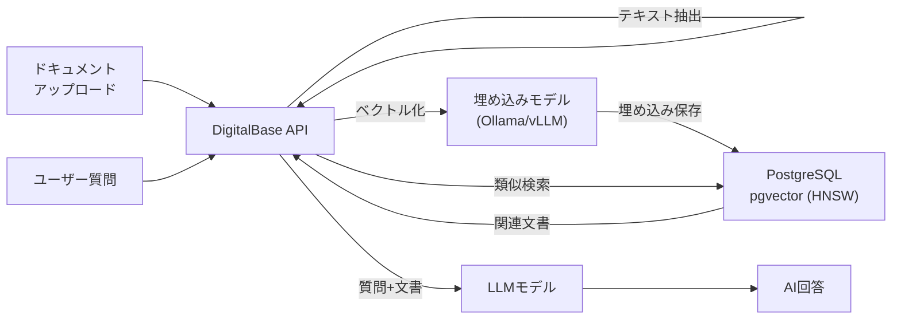

# DigitalBase システム構成図

**System Architecture**

最終更新日: 2026年5月

---

## システム概要

DigitalBase は以下のコンポーネントで構成されるオンプレミスAIプラットフォームです。Vite Edition では **API + フロントエンドを単一プロセス・単一ポート (8000)** で配信します（FastAPI が静的ファイルも返却）。



---

## コンポーネント詳細

### フロントエンド + APIサーバー (単一プロセス)

| 項目 | 内容 |
|------|------|
| フレームワーク | FastAPI (Python) + uvicorn |
| 配信形態 | SPA静的ファイル (Vite + React 19 ビルド成果物) を FastAPI 同居配信 |
| クライアント状態管理 | Zustand + localStorage |
| 認証 | JWT (HS256) + HTTP-only Cookie |
| パスワードハッシュ | bcrypt (passlib, 12ラウンド) |
| LDAP | python-ldap3 |
| OIDC | python-jose |
| ORM | SQLAlchemy 2.0+ |
| ベクトル検索 | pgvector |
| 文字起こし | pywhispercpp |
| 物体検出 | ultralytics (YOLOv8) |
| DXF処理 | ezdxf + opencv-python + pymupdf |
| ポート | 8000 (API + Web 共通、`API_PORT` で変更可) |

> **Vite Edition 移行に伴い、Next.js 時代の `next-auth` / `bcryptjs` / `ldapts` 等の Node.js 系認証ライブラリは廃止されています。**

### データベース

| 項目 | 内容 |
|------|------|
| DBMS | PostgreSQL 17 |
| 拡張 | pgvector（ベクトル類似検索 / HNSW + IVFFlat 対応） |
| デフォルトDB名 | `digitalbase` |
| デフォルトユーザー | `digitalbase` |
| ポート | 5432 |

### LLMエンジン

| エンジン | ポート | 対応OS | GPU要件 |
|---------|--------|--------|---------|
| Ollama | 11434 | macOS / Linux / Windows | 任意（CPU可） |
| vLLM (Chat) | 8080 | Linux | NVIDIA GPU 必須 |
| vLLM (Embed) | 8081 | Linux | NVIDIA GPU 必須 |
| クラウドLLM (オプション) | - | OpenAI / Anthropic / Gemini API への中継も設定可能（`.env` で有効化） | - |

**LLM通信方式:**
- APIサーバーは **httpx（Python HTTPクライアント）** でLLMエンジンと通信
- OpenAI SDK は使用せず、`/v1/chat/completions` 等のOpenAI互換エンドポイントに直接HTTPリクエスト
- Ollama / vLLM / クラウド (OpenAI 互換) いずれも同じコードパスで動作
- `VLLM_AUTO_START=false` に設定することで、外部で起動済みのvLLMサーバーにも接続可能

---

## 認証フロー

### ローカル認証（デフォルト）



### LDAP / Active Directory 認証



### OIDC / Azure AD 認証



---

## データフロー

### RAG（検索拡張生成）



---

## ポート一覧

| サービス | ポート | プロトコル | 備考 |
|---------|--------|-----------|------|
| DigitalBase (API + Web) | 8000 | HTTP | 単一プロセス・単一ポート |
| PostgreSQL | 5432 | TCP | データベース |
| Ollama | 11434 | HTTP | LLM（Ollama版） |
| vLLM Chat | 8080 | HTTP | LLM（vLLM版） |
| vLLM Embed | 8081 | HTTP | 埋め込み（vLLM版） |

> 旧 Next.js 時代に存在した「Web :3000 / API :8000」の2ポート構成は廃止されました。Vite Edition では FastAPI が SPA も配信するため、**外向きに開放するポートは 8000 のみ**です。

---

## デプロイ構成パターン

### パターン1: シングルサーバー（推奨）

すべてのコンポーネントを1台のサーバーに配置。

```
1台のサーバー
├── DigitalBase (:8000, API + Web 一体)
├── PostgreSQL (:5432)
└── Ollama / vLLM
```

### パターン2: Docker Compose

Docker Compose で全コンポーネントをコンテナ化。PostgreSQL も含まれるため個別インストール不要。

### パターン3: 分散配置

GPUサーバーにLLMエンジン、別サーバーに DigitalBase + DB を配置。`.env` で `OLLAMA_BASE_URL` / `VLLM_BASE_URL` を指定して接続。

---

## ネットワークバインド

| 設定 | 影響 |
|------|------|
| `API_HOST=0.0.0.0` (デフォルト) | LAN内の他PC・スマホからアクセス可能 |
| `API_HOST=127.0.0.1` | サーバー本体からのみアクセス可（最もセキュア） |

> インストーラーは利便性を優先して `0.0.0.0` をデフォルトとします。LAN露出を避けたい場合は `~/.local/db/.env` の `API_HOST` を `127.0.0.1` に変更してください。

---

## お問い合わせ

**デジタルベース株式会社**
- ウェブサイト: https://digital-base.co.jp
- プロダクトサイト: https://lmlight.jp

---

Copyright (c) 2026 デジタルベース株式会社 All rights reserved.
